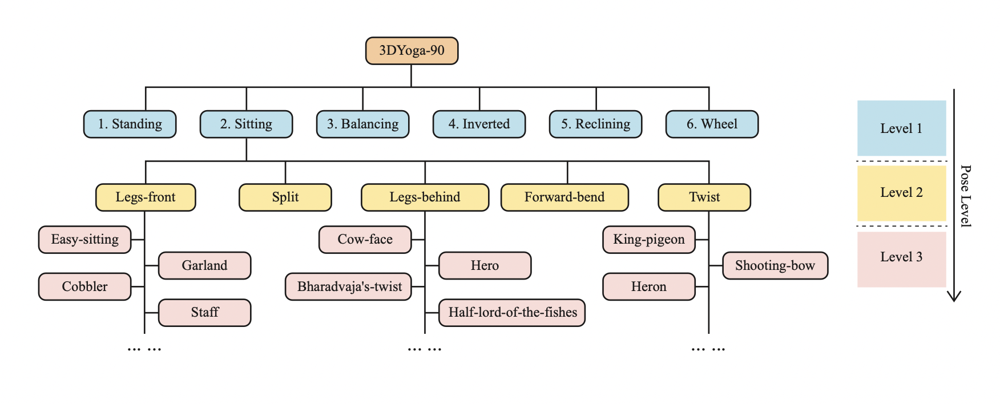

# 3DYoga90


This repo is the official repo of 3DYoga90 dataset. If you want to download original videos and sequences, follow the steps below. 


Step 1. Download raw videos.

```
cd data_process
python video_downloader.py
```

Step 2. Extract sequences from raw videos using [3DYoga90.json](https://github.com/seonokkim/3DYoga90/blob/main/data/3DYoga90.json).

```
python preprocess.py
```

Step 3. Generate skeleton files from the sequences.

```
python skeleton_generator.py
```

 If you want to download the skeleton dataset of sequences, download files from [google drive](https://drive.google.com/drive/folders/11SOWVJ5CF5pbkftMqogVP5Pkyg88hbau?usp=sharing). The dataset structure is inspired by [Google - Isolated Sign Language Recognition](https://www.kaggle.com/competitions/asl-signs/data?select=train_landmark_files).


## License
The annotations of 3DYoga90 are copyright by us and published under the Creative Commons Attribution-NonCommercial 4.0 International License.


## Acknowledgement
We created our dataset and codes influenced by the source below. We thank the authors for releasing the codes and dataset.
- [MS-ASL](https://www.microsoft.com/en-us/research/project/ms-asl/)
- [WLASL](https://github.com/dxli94/WLASL)
